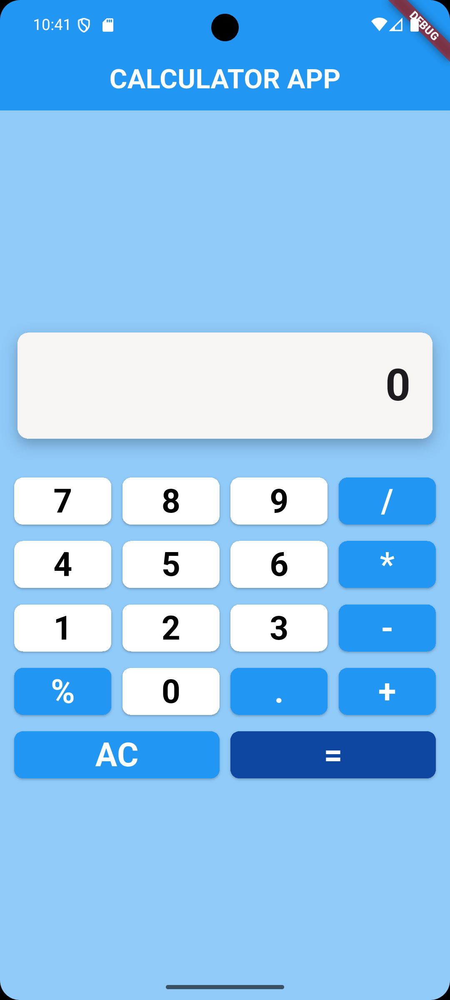
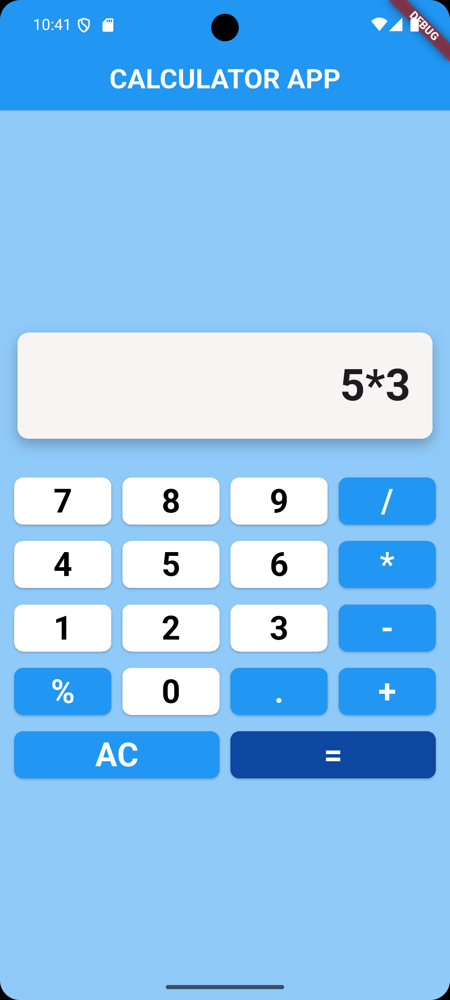
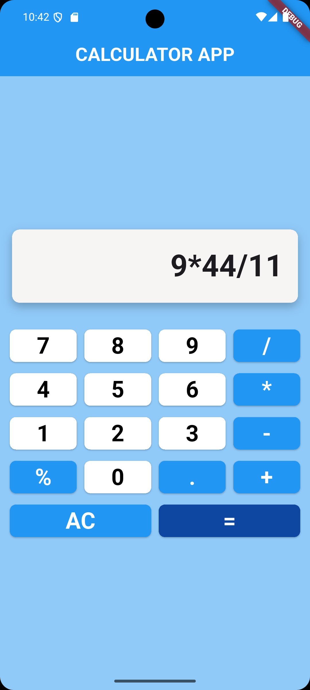
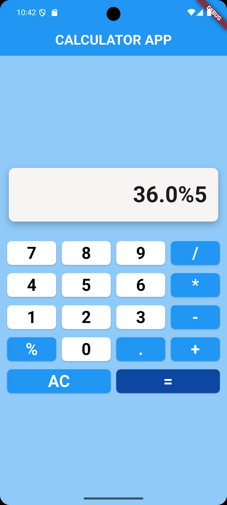
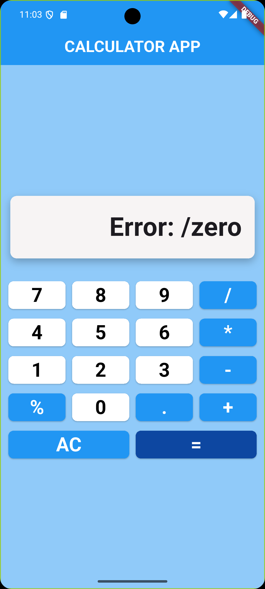

# calculator_app

**Project 1: Build a Basic Calculator App**  
**Objective:** Create a Flutter app that functions as a basic calculator.

## Requirements:

- Button with numbers.
- Buttons for basic operations: Add, Subtract, Multiply, and Divide and Modulos.
- Display the result after clicking an operation.
- Validate inputs (no divide by zero, etc.).
- Optional: Style the calculator to look like a physical one.

## App Screenshots

<h3>Application UI</h3>

<h3>Calculations</h3>

 
 

   

<h3>Handling divide by zero</h3>

 
