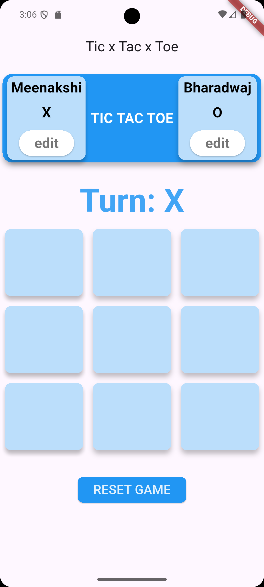
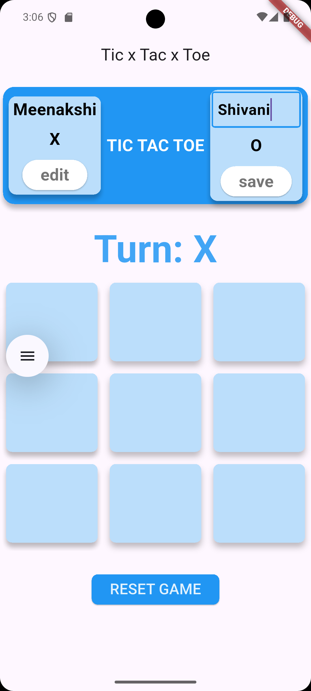
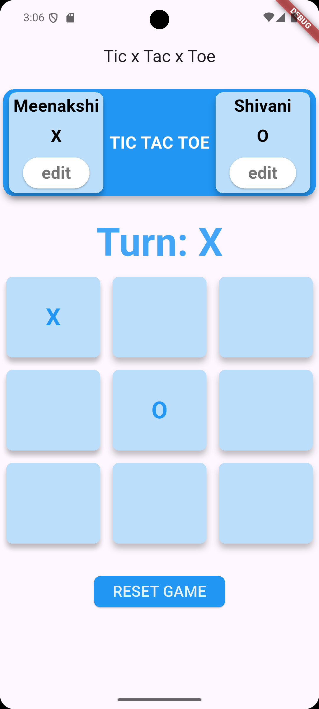
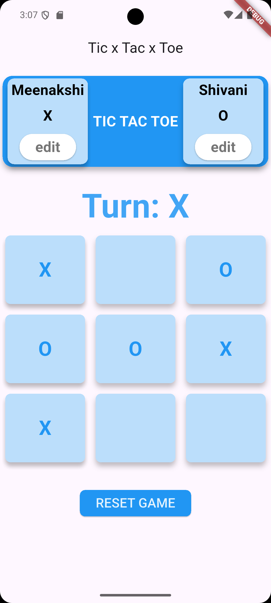
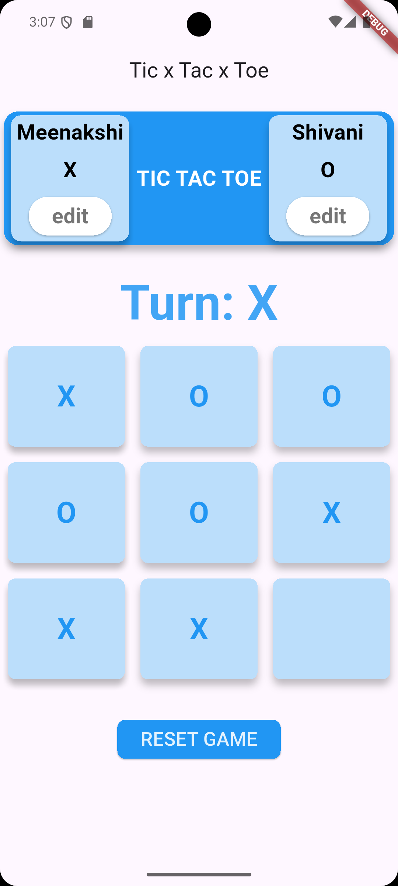
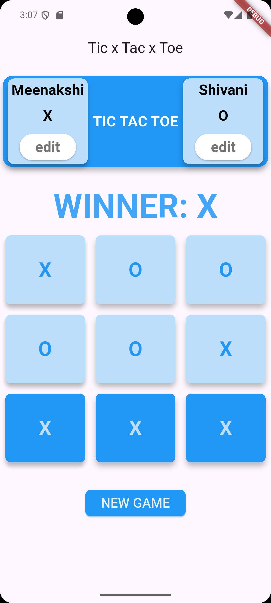
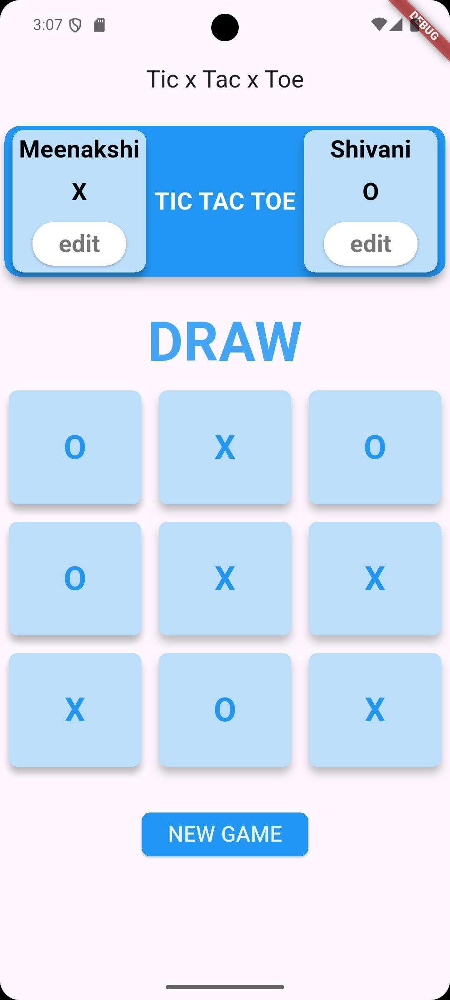
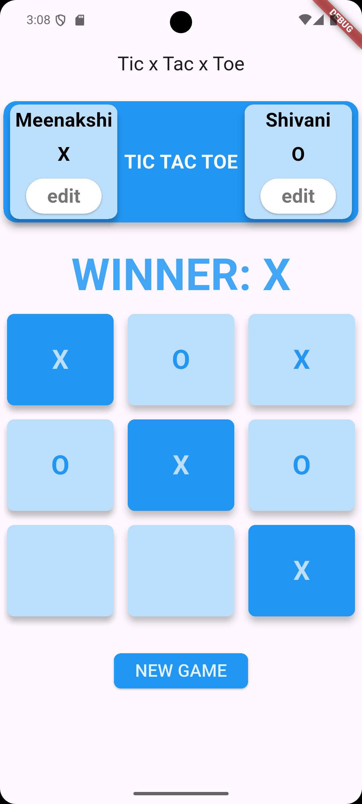

# tictactoe_app

**Project 2: Build a Tic Tac Toe Game**  
**Objective:** Develop a 2-player Tic Tac Toe game.

## Requirements:

- A 3x3 grid of square buttons.
- Allow two players to take turns tapping grid cells to place “X” or “O”.
- Display the current player's turn.
- Detect the winner or a draw.
- Option to reset the game.

## App Screenshots

<h3>Initial UI</h3>

<h3>Editing Name </h3>

<h3>Game Playing<h3>

   

<h3> Game States: WIN, DRAW </h3>

 
